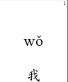

# Chinese Flashcards

Flashcards made in LaTeX of Chinese characters. 

Compile with LaTeX, print 'em out, cut 'em out. 

For old fashioned paper lovers.

Characters are taken from the Hello Chinese app as I study it.